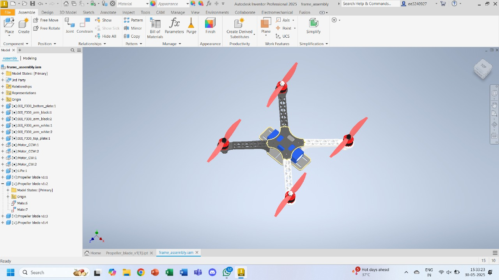

# Robotics Summer Project 2025-26

  
  
  
  

    
     
   
  

## 🤖 Project Overview

The aim of this project is to simulate and create a pixhawk based delivery drone which can carry a parcel from one location to another, first manually using remote control, and then autonomously. A rigorous simulation on a model similar to the actual drone will be carried on Gazebo using the PX4 firmware, to test the drone's efficiency in every possible scenario and ensure that the drone, as well as the parcel, remain safe in most of the cases.

### 🎯 Goals

- ✅ Assemble and control the drone without GPS and telemetery
- ✅ Simulate the default iris quadcoptor on Gazebo
- ✅ Import a custom drone model in the PX4 environment
- 🟡 Simulate the custom drone on gazebo
- 🟡 Test the gripper in the simulation
- 🟡 Modify basic parameters like thrust, mass, gravity etc. to account for all eventualities
- 🟡 Add the gripper to the pixhawk quadcopter and fly the quadcopter with a payload (parcel)
- 🟡 Automate the entire process

## Firmware Installation and Setup
!ToDo()

## Hardware Setup and Calibration

The softwares needed to setup the hardware are :
- Qground Control/Mission Planner as ground station (in our case it is Qground Control)
- Ardupilot/PX4 firmware

We follow [Qground control installation](https://docs.qgroundcontrol.com/master/en/qgc-user-guide/getting_started/download_and_install.html) for installation of ground station.

Then we installed the PX4 firmware in pixhawk from firmware install section of Qground control.

After which, we have to change the default parameters so that we can disable the telemetry and GPS:
1. Disable GPS Usage and GPS Failsafe
	-	Disable GPS Hardware Detection:
	  -	Set `SYS_HAS_GPS` to `0` to indicate there is no GPS module.
	-	Disable GPS Aiding in EKF:
	  -	Set `EKF2_AID_MASK` to `3` (use only vision and barometer, no GPS).
	-	Allow Arming Without GPS:
	  -	Set `COM_ARM_WO_GPS` to `1` (allows arming without GPS).
	-	Position Loss Failsafe:
	  -	Set `COM_POSCTL_NAVL` to `0` (if using RC), so the drone switches to Altitude/Stabilized mode upon position loss, not failsafe.
	-	Optional: For some setups, you may also need to set circuit breakers:
	  -	`CBRK_GPSFAIL` to `240024` (disables GPS failsafe).
2. Disable Telemetry
	-	Disable MAVLink Telemetry Ports:
	  -	Set `MAV_0_CONFIG`, `MAV_1_CONFIG`, and `MAV_2_CONFIG` to `Disabled` (prevents PX4 from expecting telemetry hardware).
	-	Disable Data Link Loss Failsafe:
	  -	Set `NAV_DLL_ACT` to `Disabled` (no action if telemetry link is lost).
3. Disable Battery Failsafe
	-	Disable Battery Level Failsafes:
	  -	Set `COM_LOW_BAT_ACT` to `0` (no action on low battery).
	  -	Set `BAT_LOW_THR`, `BAT_CRIT_THR`, and `BAT_EMERGEN_THR` to `0` (disables battery warning, failsafe, and emergency actions).
  -	Disable Minimum Battery for Arming:
	  -	Set `COM_ARM_BAT_MIN` to `0` (allows arming with any battery level).
   
Next, there is settings for mode(inside the flight mode section):
- we set the mode to channel 5, such that
  - when the position is up, its in stabilized mode.
  - when the position is middle, its in Alt hold mode.
  - when the position is low, its in the land mode.
 
- Also we set the radio failsafe to land mode
  - Set `NAV_RCL_ACT` to `2` (corresponds to land mode).
 
And finally the calibrations (you will get the option on vehicle setup->left sidebar:
1. Accelerometer calibration
2. Gyroscope calibration
3. Compass calibration
4. FOR ACCELEROMETER,GYROSCOPE,COMPASS : GO TO SENSORS WINDOW AND FOLLOW THE INSTRUCTIONS
5. Radio/RC calibration : TURN ON THE RC ---> RADIO TAB
6. ESC calibration : POWER TAB (CONNENCT TO USB , WAIT THEN CONNECT TO BATTERY AFTER THE PROMPT)

## Simulations

The software needed are :
- Gazebo Classic
- PX4-Autopilot

1. Installations
- Gazebo Classic
- `sudo apt install aptitude`
- `sudo apt install gazebo libgazebo11-dev`

- PX4-Autopilot
- `git clone https://github.com/PX4/PX4-Autopilot.git --recursive`
- `bash ./PX4-Autopilot/Tools/setup/ubuntu.sh`

  Restart the computer.

2. Running Simulations
- go the px4 directory
- `cd PX4-Autopilot`
- terminal command for default model:
- `make px4_sitl gazebo-classic`
- terminal command for certain <custom> model:
- `make px4_sitl gazebo-classic_custom`
  
3. File Structure
- A custom model folder
   Tools/simulation/gazebo-classic/sitl/models/custom_model

- custom model should have
  1. Meshes folder
  2. custom_model.sdf
  3. model.config

- Meshes folder should have
  1. custom_model.stl
  2. propeller cw.dae
  3. propeller ccw.dae

REMARKS : 
1. It is suggested to modify the default models rather than making everything from scratch.

2. sdf files cannot be easily generated from some tools => modify the parameters in a default .sdf

3. Or use a .jinja template just in case you need to make a .sdf
4. moving parts must be stored as dae.
5. .stl for the visuals
6. .sdf for the data required for the simulations

## ROS2 Humble and Teleop
1. Installing ROS2 from ROS documentation of debian packages(recommended)
 - [ROS2 Humble](https://docs.ros.org/en/humble/Installation/Ubuntu-Install-Debs.html)
 - Test basic ros2 :
 - `ros2 run demo_nodes_cpp talker`

2. Clean insatllation of Micro XRCE-DDS agent (Creates a Bridge between PX4 and ROS2)
   ## Install dependencies:
   - `sudo apt update`
   - `sudo apt install git cmake g++ libasio-dev libtinyxml2-dev`
   ## Create a Workspace Director
   - `mkdir -p ~/micrortps_ws && cd ~/micrortps_ws`
   ## Cloning from github
   - `git clone https://github.com/eProsima/Micro-XRCE-DDS-Agent.git`
   - `cd Micro-XRCE-DDS-Agent`
   - `git submodule update --init --recursive`
   ## Build
   - `cd ~/micrortps_ws/Micro-XRCE-DDS-Agent`
   - `mkdir build && cd build cmake .. -DUAGENT_USE_SYSTEM_FASTDDS=OFF -DUAGENT_USE_SYSTEM_FASTCDR=OFF`
   - `make -j$(nproc)`
   - `sudo make install`
   ## Update Library Cache
   - `sudo ldconfig`
   ## Run using udp port
   - `MicroXRCEAgent udp4 -p 8888`

3. Setting up our own teleop ros package
       1. Install teleop keyboard
       `sudo apt install ros-humble-teleop-twist-keyboard`

	2. Create a working directory
	`mkdir -p ~/px4_ros2_ws/src
	cd ~/px4_ros2_ws/src`
	
	3. Install px4 msgs and ros com
	`git clone https://github.com/PX4/px4_msgs.git
	git clone https://github.com/PX4/px4_ros_com.git`
	
	4. Install dependencies
	`sudo apt update
	rosdep update
	rosdep install --from-paths src --ignore-src -r -y`
	
	5. Build workspace
	`cd ~/px4_ros2_ws
	colcon build`
	
	6. Source the setup
	`source install/setup.bash`
	
	7. Now create your custom teleop folder
	`cd ~/px4_ros2_ws/src
	ros2 pkg create teleop_px4 --build-type ament_python --dependencies rclpy geometry_msgs px4_msgs`

   
   

   
## ⏱️ Project Timeline
Main idea is to build a very very basic version first, probably within 2 weeks and then work on modifying it, (believe me doing otherwise is stupidity...)

### Week 1: Introduction
- Review the competition rulebook
-  Be familiar with github
-  Brainstorm ideas and design concepts based in the video,
-  Prepare Bill of Materials
-  Draft electronic system diagram
-  !TODO()

### Week 2: Hardware Assembly
-  Assemble mechanical components
-  !TODO()

### Week 3: Debugging
-  Hardware and software troubleshooting
- Yaw (spinning around the vertical axis) was observed as soon as the drone gets a throttle.
-  possible reason was less current (low pwm) of diagonal motors.
-  later confirmed by simulation into gazebo
-  similar spin was observed when the pwm of two diagonally placed motors was changed from 1100 to 100 in .sdf of the simulation model in gazebo.
-  !TODO()

### Week 4: Algorithm Refinement
-  Enhance hardware robustness
-  !TODO()

### Weeks 5-7: Progressive Enhancements
- 🔄 Implement iterative improvements (tbd)
- !TODO()

## 📚 Resources

### Tools and References (tbd)
- !TODO()

### Development Software
- !TODO()

## 🤝 Contributor Notes
- We follow the [standard Git workflow](https://www.geeksforgeeks.org/git-workflows-with-open-source-collaboration/) for collaboration
- Suggestions for improvement are welcome via **Issues** or Discussions.

---

